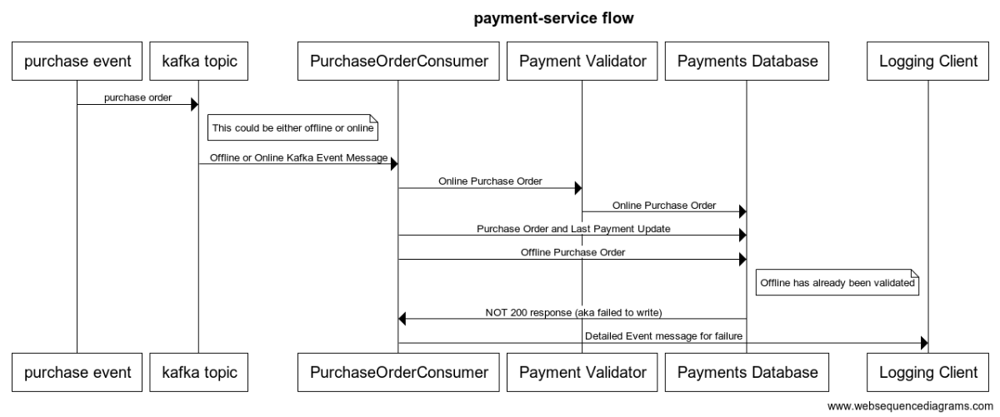

# payment-service
A service consumer designed to stream data from kafka topics to postgres database for persistence. It handles both online and offline payments validating where necessary and provides detailed error logs when there are failures.

### :computer: How to execute

#### Running with existing build inside docker:

`sh start-docker.sh`

#### Run as a new build:
If you would like to run on local as a new build use gradle:

`gradle clean build run`

or

`./graldew clean build run`

Note: You may want to test as well and if so execute the previous command first then run the clean build.

#### Create a new build and run in docker-compose environment

This will do a full rebuild for the application and for the docker-compose environment.
Note: Don't forget to update your config (delivery/PaymentService/bin/config_docker.yml)

sh build-publish-docker-start.sh

#### Troubleshooting

From time to time it may be necessary to do a docker-compose down in the delivery directory to clear all the images and running containers. Every now and then it will default to localhost in the docker-compose and this seems to resolve it.

### :memo: Design Notes and Diagrams

The service in the system is designed such that is can be scaled to n given enough database connections for the incoming kafka streams. It is fully configurable from the config.yml files for all of the components loaded at runtime.

Below is the proposed high level architecture:

This is the general sequence of events representing the transactional data flow of the payments.

### :pushpin: Things to improve
- Change the producer to use protobuf directly as binary to kafka so that the deserialization will be easier and also more compact
- Would add in SonarQube, Jacoco, Snyke and google checkstyle as part of the final build CI/CD process
- Update the producer, and all protos and schema to store the currency as micro and add in currency type so as not to lose monetary precision and preserve the currency unit
- Update the producer, protos and schemas to add a credit card type to go with the cc number
- Add in integration tests using testcontainers for all the things
- All around more unit testing for negative test cases and clients with wiremock
