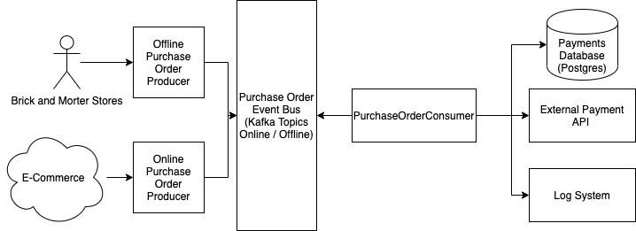

# technical-test-payment-service
A service consumer designed to stream data from kafka topics to postgres database for persistence. It handles both online and offline payments. 

### :computer: How to execute

### :memo: Design Notes and Diagrams

The service in the system is designed such that is can be scaled to n given enough database connection for the incoming kafka streams.
It is fully configurable from the config.yml files for all of the components loaded at runtime.

Below is the proposed high level architecture:

This is the general sequence of events representing the transactional data flow of the payments.

### :pushpin: Things to improve
- Change the producer to use protobuf directly as binary to kafka so that the deserialization will be easier and also more compact
- Would add in SonarQube, Jacoco, Snyke and google checkstyle as part of the final build CI/CD process
- Update the producer, and all protos and schema to store the currency as micro and add in currency type so as not to lose monetary precision and preserve the currency unit
- Update the producer, protos and schemas to add a credit card type to go with the cc number
- Add in integration tests using testcontainers for all the things
- All around more unit testing for negative test cases and clients with wiremock